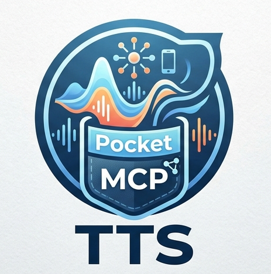

# PocketTTS-MCP



Starter workspace for downloading and running a local PocketTTS model as an MCP server.

## What this includes

- A token-based Hugging Face model downloader script.
- Local project setup for Python dependencies.
- Safe defaults to keep secrets and model files out of git.
- An MCP server entrypoint with synth tools and voice listing.
- A local web GUI.
- Docker and docker-compose support.

## Prerequisites

- Python 3.10+
- A valid Hugging Face access token in `secrets.env`

## Quick Start

1. Create and activate a virtual environment:

```powershell
py -3.11 -m venv .venv
.\.venv\Scripts\Activate.ps1
```

2. Install dependencies:

```powershell
.\.venv\Scripts\python.exe -m pip install -r requirements.txt
```

3. Ensure `secrets.env` contains your token:

```env
HUGGINGFACE_HUB_TOKEN=hf_xxx
```

4. Download the default PocketTTS model (`kyutai/pocket-tts`):

```powershell
.\.venv\Scripts\python.exe scripts/download_model.py
```

The model will be downloaded to `models/pocket-tts` by default.

## Run Instructions

Run MCP server (stdio):

```powershell
.\.venv\Scripts\python.exe server.py
```

Important: this is a stdio server for MCP clients. Do not type random text or press Enter in that terminal after launch. Any manual input is treated as JSON-RPC and can produce `Invalid JSON` errors.
By default, starting MCP also launches the Gradio GUI sidecar on port 7860.
It will try to open your browser automatically.

If sidecar GUI does not appear, check:

- `http://localhost:7860`
- `outputs/gui_sidecar.log` for startup errors

Disable sidecar launch if needed:

```powershell
$env:POCKETTTS_AUTOSTART_GUI="0"
.\.venv\Scripts\python.exe server.py
```

Run GUI:

```powershell
.\.venv\Scripts\python.exe gui.py
```

Run local client:

```powershell
.\.venv\Scripts\python.exe clients/play_client.py --text "PocketTTS is ready"
```

Note: `--text` is required for `play_client.py`.

Default voice preference is `bricktop` when available.

Run Docker GUI:

```powershell
docker compose up --build
```

## Optional: Custom Model or Output Path

```powershell
.\.venv\Scripts\python.exe scripts/download_model.py --model-id kyutai/pocket-tts --output-dir models/pockettts-main
```

## Smoke Test

```powershell
.\.venv\Scripts\python.exe scripts/smoke_test.py
```

## Next Step for MCP Server

The project includes [server.py](server.py), which exposes PocketTTS tools over MCP stdio.

### Start the MCP server

```powershell
.\.venv\Scripts\python.exe server.py
```

### Exposed tools

- `health()`
- `list_voices()`
- `list_output_devices()`
- `get_audio_routing()`
- `set_audio_routing(output_device=None, auto_chat=None, persist_to_config=False, config_path=None, server_name="pockettts-local")`
- `synthesize(text, voice, output_path=None)`
- `synthesize_chunked(text, voice, chunk_size=180, output_dir=None, merged_output_path=None, merge_output=True)`
- `speak_now(text, voice, output_path=None, block=True, keep_file=False, output_device=None)`
- `create_voice(voice_name, audio_path, overwrite=False)`

Default voice is `bricktop` (falls back to `alba`). If `output_path` is not provided, audio goes to `outputs/tts_<timestamp>.wav`. For chunked generation, chunks can be merged into one file. `speak_now` plays audio immediately on your local machine; by default it plays from memory and does not save a WAV unless `keep_file=True` or `output_path` is set.
Automatic routing: if your current Windows default output is an Arctis/Sonar **Game** device, PocketTTS will auto-route playback to the matching **Chat** device for that call.
If headset routing is not applicable, it falls back to normal system output behavior.

### Audio Routing

PocketTTS can route playback to a specific audio device. List available devices:

```python
list_output_devices()
```

Set routing per-call via the `output_device` parameter in `speak_now`/`synthesize`. Configure persistent defaults with environment variables:

- `POCKETTTS_OUTPUT_DEVICE` — device name or index (use `system` for default output)
- `POCKETTTS_AUTO_CHAT` — set to `0` to disable automatic Game → Chat routing

SteelSeries Arctis users: TTS auto-routes from Game to Chat device when detected.

### MCP Config

The project includes a `.vscode/mcp.json` with `${workspaceFolder}` paths. For other editors, adapt this template:

```json
{
	"servers": {
		"pockettts-local": {
			"command": "path/to/.venv/Scripts/python.exe",
			"args": ["path/to/server.py"],
			"env": {
				"POCKETTTS_OUTPUT_DEVICE": "system",
				"POCKETTTS_AUTO_CHAT": "1"
			}
		}
	}
}
```

## Local GUI

```powershell
.\.venv\Scripts\python.exe gui.py
```

Open http://localhost:7860

### Voice Cloning

1. Open the GUI.
2. In **Voice Cloning**, enter a new voice name.
3. Upload or record an audio sample.
4. Click **Save embedding**.
5. The new voice is saved to `voice_embeddings/<name>.safetensors` and appears in the voice dropdown.

After that, use the saved voice name in GUI, MCP tools, or the local client.

## Client

```powershell
.\.venv\Scripts\python.exe clients/play_client.py --text "PocketTTS is online."
```

## Docker

```powershell
docker compose up --build
```

Serves the GUI on port 7860, mounts `./models` and `./outputs`. For headless MCP mode:

```powershell
docker run --rm -it --env-file secrets.env -e POCKETTTS_MODE=mcp pockettts-mcp
```
